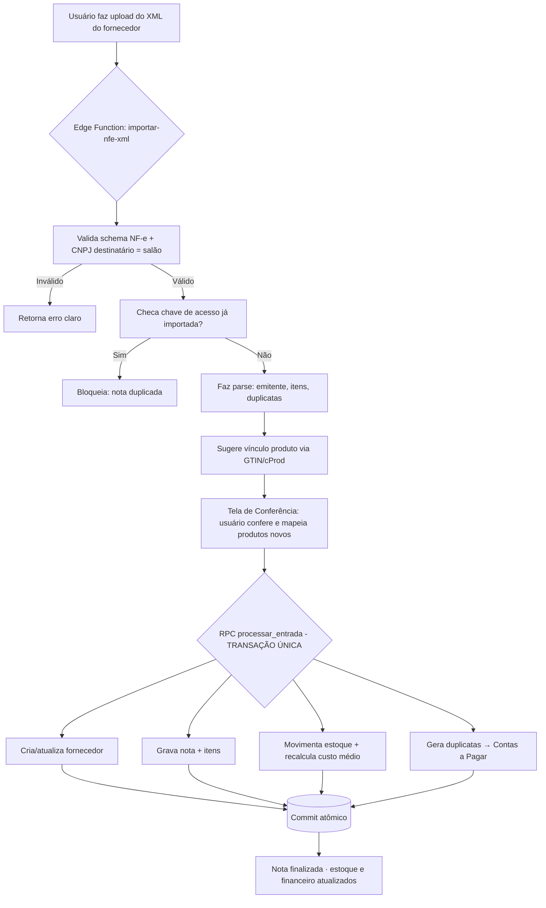

# Plano de Implementação — Módulo de Entrada de Produtos (Compras & Fornecedores)

**Projeto:** Sistema de Salão · Arquitetura Fiscal
**Stack:** Supabase (Postgres + RLS + Storage + Edge Functions/Deno) · `node-sped-nfe` · Frontend existente
**Escopo deste plano:** Notas Fiscais de **Entrada** (modelo 55), Fornecedores, Estoque e ligação com Contas a Pagar.
**Fora de escopo:** Emissão de Saída (NF-e/NFC-e) — já tem frontend pronto e está só esperando o backend de assinatura. A mesma infra de certificado A1 / assinatura será **reaproveitada** aqui na parte de Manifestação.

---

## 0. Princípio que guia tudo: "sem falhas"

Esse módulo mexe em três coisas ao mesmo tempo — **estoque, custo e dinheiro a pagar**. Se uma falhar e a outra não, o salão fica com saldo errado ou boleto fantasma. Então a regra de ouro do plano é:

> **Importar uma nota é uma operação atômica: ou entra estoque + custo + financeiro + registro da nota tudo junto, ou não entra nada.**

Isso é resolvido com uma **função RPC no Postgres (transação única)**, nunca com vários `insert` soltos vindos do frontend. Todo o resto do plano foi desenhado em torno disso.

---

## 1. Decisões pendentes (travar antes de codar)

Quatro definições que mudam o schema. Sugestão minha em **negrito**.

| # | Decisão | Opções | Sugestão |
|---|---------|--------|----------|
| 1 | Regime tributário do salão | Simples Nacional / Lucro Presumido | **Simples** — não calcula crédito de ICMS/IPI; só armazena os impostos da nota para histórico. Simplifica MUITO o Fase 2. |
| 2 | Método de custo | Custo médio ponderado / Último custo (FIFO simplificado) | **Custo médio ponderado** — é o que dá margem real no relatório de vendas. |
| 3 | O que compõe o custo de entrada | Só valor do produto / + frete rateado / + IPI + desconto | **Configurável**, default = `valor do produto − desconto + frete rateado`. |
| 4 | Manifestação automática (DF-e) | Agora / Depois | **Depois (Fase 5)** — entrega valor com upload manual primeiro, automatiza quando a assinatura A1 estiver validada. |

---

## 2. Visão geral do fluxo (o coração do módulo)



---

## 3. Banco de Dados (Fase 1)

Todas as tabelas têm `salao_id` (multi-tenant) e **RLS ativo**. Datas em `timestamptz`. Dinheiro em `numeric(15,2)`, quantidades em `numeric(15,4)` (XML de NF-e tem 4 casas).

### 3.1 `fornecedores`
```
id                uuid pk
salao_id          uuid  not null  → tenant
tipo_pessoa       text  ('PJ'|'PF')
documento         text  not null   -- CNPJ ou CPF, só números
razao_social      text  not null
nome_fantasia     text
inscricao_estadual text
endereco_*        (logradouro, numero, bairro, municipio, uf, cep)
email, telefone   text
ativo             boolean default true
created_at / updated_at

UNIQUE (salao_id, documento)   -- não duplica fornecedor por salão
```

### 3.2 `produto_fornecedor`  *(o "de-para" — peça mais importante)*
Resolve o problema de que o código do produto do fornecedor (`cProd`) **não é** o código do salão.
```
id                  uuid pk
salao_id            uuid not null
produto_id          uuid → produtos
fornecedor_id       uuid → fornecedores
codigo_fornecedor   text   -- cProd da nota
ean                 text   -- GTIN/código de barras
unidade_compra      text   -- uCom (ex: CX)
fator_conversao     numeric(15,4) default 1  -- 1 CX = 12 UN → fator 12
ultimo_custo        numeric(15,2)

UNIQUE (salao_id, fornecedor_id, codigo_fornecedor)
```

### 3.3 `notas_fiscais_entrada`
```
id                uuid pk
salao_id          uuid not null
fornecedor_id     uuid → fornecedores
chave_acesso      text  not null   -- 44 dígitos
numero            integer           -- nNF
serie             integer
modelo            text default '55'
natureza_operacao text                -- natOp
data_emissao      timestamptz         -- dhEmi
data_entrada      timestamptz         -- registro no salão
valor_produtos    numeric(15,2)
valor_desconto    numeric(15,2)
valor_frete       numeric(15,2)
valor_outros      numeric(15,2)
valor_total       numeric(15,2)       -- vNF
protocolo         text
status            text  ('importada'|'conferindo'|'finalizada'|'cancelada')
xml_storage_path  text                -- bucket
dados_brutos      jsonb               -- parse completo, auditoria
created_by        uuid
created_at        timestamptz

UNIQUE (salao_id, chave_acesso)   -- ⚠️ DEDUP: impede importar a mesma nota 2x
```

### 3.4 `itens_nota_entrada`
```
id                       uuid pk
nota_entrada_id          uuid → notas_fiscais_entrada (on delete cascade)
produto_id               uuid → produtos  (NULL até ser mapeado)
numero_item              integer            -- nItem
codigo_fornecedor        text               -- cProd
descricao                text               -- xProd
ncm                      text
cfop                     text
ean                      text
unidade_comercial        text               -- uCom
quantidade_comercial     numeric(15,4)      -- qCom
valor_unitario_comercial numeric(15,4)      -- vUnCom
valor_total_item         numeric(15,2)      -- vProd
desconto_item            numeric(15,2)
custo_unitario_calculado numeric(15,4)      -- preenchido no commit
vinculado                boolean default false
```

### 3.5 `duplicatas_entrada`  *(→ vira boleto no Contas a Pagar)*
```
id              uuid pk
nota_entrada_id uuid → notas_fiscais_entrada
numero_dup      text          -- nDup
vencimento      date          -- dVenc
valor           numeric(15,2) -- vDup
conta_pagar_id  uuid → contas_pagar  (preenchido no commit)
```

### 3.6 `movimentacoes_estoque`  *(se ainda não existir)*
```
id              uuid pk
salao_id        uuid
produto_id      uuid
tipo            text ('entrada'|'saida'|'ajuste')
origem_tipo     text ('nota_entrada'|'venda'|'manual')
origem_id       uuid
quantidade      numeric(15,4)
custo_unitario  numeric(15,4)
saldo_anterior  numeric(15,4)
saldo_posterior numeric(15,4)
data            timestamptz
```

> **`produtos`** (já existe p/ vendas): garantir as colunas `ean/gtin`, `ncm`, `unidade`, `custo_medio numeric(15,4)`, `estoque_atual numeric(15,4)`. Adicionar via migration se faltar.

### 3.7 RLS (padrão para todas)
```sql
alter table fornecedores enable row level security;
create policy tenant_isolation on fornecedores
  using (salao_id = (auth.jwt() ->> 'salao_id')::uuid);
```
*(ou via tabela de membership, conforme o padrão que você já usa nas tabelas de Saída).*

### 3.8 Storage
Bucket privado **`notas-entrada-xml`**, caminho `{salao_id}/{chave_acesso}.xml`. Guardar o XML original sempre (exigência fiscal: 5 anos).

---

## 4. Fase 2 — Importação de XML (MVP que já entrega valor)

### 4.1 Edge Function `importar-nfe-xml` (parse + preview, **não commita ainda**)
Entrada: arquivo `.xml` (ou path no Storage). Saída: JSON estruturado + sugestões de vínculo.

Passos internos:
1. **Parse** do XML (parser compatível com Deno, ex. `fast-xml-parser` via `npm:`).
2. **Validações duras** (qualquer falha → erro claro, sem gravar nada):
   - É um `procNFe`/`NFe` válido? Tem `infNFe`?
   - `dest/CNPJ` == CNPJ do salão? *(impede importar nota de outro estabelecimento)*
   - `chave_acesso` já existe em `notas_fiscais_entrada`? → "Nota já importada em DD/MM".
3. **Extração**:
   - Emitente (`emit`) → dados do fornecedor.
   - Itens (`det[]` → `prod`): cProd, xProd, NCM, CFOP, cEAN, uCom, qCom, vUnCom, vProd, uTrib, qTrib.
   - Totais (`total/ICMSTot`): vProd, vDesc, vFrete, vOutro, vNF.
   - **Duplicatas** (`cobr/dup[]`): nDup, dVenc, vDup → base do Contas a Pagar.
4. **Sugestão de vínculo** por prioridade: `GTIN/EAN` → `produto_fornecedor.codigo_fornecedor` → sem match (produto novo).
5. Retorna preview para a tela de conferência.

### 4.2 RPC `processar_entrada` (Postgres, **transação única** — o commit)
Recebe o payload já conferido/mapeado e faz **tudo dentro de uma transação**:
1. `upsert` fornecedor (por `salao_id + documento`).
2. Insere `notas_fiscais_entrada` + `itens_nota_entrada`.
3. Para cada item vinculado:
   - Converte quantidade: `qtd_interna = qCom × fator_conversao`.
   - Calcula custo de entrada (regra da Decisão #3).
   - **Recalcula custo médio**:
     `novo_custo = (estoque_atual × custo_medio + qtd_entrada × custo_entrada) / (estoque_atual + qtd_entrada)`
   - Insere `movimentacoes_estoque` e atualiza `produtos.estoque_atual` / `custo_medio`.
   - Atualiza `produto_fornecedor.ultimo_custo`.
4. Gera `contas_pagar` (uma por duplicata) e amarra em `duplicatas_entrada.conta_pagar_id`.
5. Marca a nota como `finalizada`.

> Se **qualquer** passo falhar → `ROLLBACK` automático. Nada de estoque mexido sem financeiro, nem vice-versa. **Idempotência** garantida pelo `UNIQUE(salao_id, chave_acesso)`.

### 4.3 Tela "Entrada de Estoque / Compras" (frontend)
- **Upload** do `.xml` (drag & drop).
- **Tela de Conferência**: cabeçalho (fornecedor, nº, valor, vencimentos) + grade de itens.
- Cada item: descrição do fornecedor → dropdown "vincular a produto existente" **ou** botão "criar produto novo" (já preenchendo NCM, EAN, unidade).
- Campo de **fator de conversão** quando a unidade de compra ≠ unidade de venda (caixa vs. unidade).
- Painel lateral: **duplicatas que virarão boletos** (datas + valores), com aviso "Isso gerará X lançamentos no Contas a Pagar".
- Botão **Confirmar entrada** → chama a RPC.
- Lista/painel de notas de entrada importadas com filtro por status e fornecedor.

### 4.4 Critérios de aceite (Fase 2)
- [ ] Importar XML real da Wella/L'Oréal popula fornecedor, itens e duplicatas corretamente.
- [ ] Reimportar o mesmo XML é **bloqueado** com mensagem clara.
- [ ] XML de outro CNPJ é rejeitado.
- [ ] Produto novo criado na conferência fica vinculado para a **próxima** importação (de-para memorizado).
- [ ] Estoque e custo médio batem na conta manual de um caso de teste.
- [ ] Falha forçada no meio do processo **não deixa resíduo** (rollback comprovado).

---

## 5. Fase 3 — Integração com Contas a Pagar

Já é gerada dentro da mesma transação da Fase 2 (passo 4 da RPC), mas merece checklist próprio:

- Cada `dup` do XML → 1 conta a pagar com **vencimento e valor exatos**.
- Vincular `fornecedor_id`, `nota_entrada_id` e categoria "Compra de Produtos".
- Se a nota **não tiver** `cobr/dup` (pagamento à vista): gerar **1 conta** com vencimento = data de emissão (ou data de entrada, configurável).
- Validação: `Σ duplicatas` deve bater com `valor_total` da nota → se divergir, avisar antes de confirmar.
- **Reversão**: ao cancelar a nota de entrada, estornar estoque **e** marcar as contas a pagar como canceladas (nova RPC `cancelar_entrada`, também atômica).

**Aceite:** comprou R$ 2.000 em 2 boletos → aparecem exatamente 2 lançamentos, nas datas certas, somando R$ 2.000, ligados à nota.

---

## 6. Fase 4 — Robustez de estoque e operação

- **Recebimento divergente**: campo "quantidade recebida" ≠ "quantidade da nota" (chegou menos do que veio na nota) → registra divergência, entra o que realmente chegou.
- **Arredondamento**: padronizar `numeric` em todo o caminho; nunca usar `float` para dinheiro.
- **Conversão de unidade** testada com caso real (compra em CX, vende em UN).
- **Relatórios**: histórico de compras por fornecedor, evolução de custo por produto, produtos sem vínculo pendentes.
- **Auditoria**: `dados_brutos` (jsonb) preserva o parse para conferência futura.

---

## 7. Fase 5 — Manifestação do Destinatário (DF-e) · automação avançada

Reaproveita a **mesma infra de certificado A1 + assinatura** do módulo de Saída. Por isso vem **depois** que a assinatura estiver validada.

### 7.1 Edge Function `distribuicao-dfe`
- Usa `node-sped-nfe` (serviço **NFeDistribuicaoDFe**) com o A1 do salão.
- Pagina por **`ultNSU`** (último NSU processado, guardado por salão) — o webservice devolve em lotes (~50 docs). Loop até `ultNSU == maxNSU`.
- Descompacta os docs (base64 + gzip): resumos (`resNFe`) e XMLs completos (`procNFe`).
- Grava resumos como notas "pendentes de manifestação" na tela da recepção.

### 7.2 Edge Function `manifestar-nfe`
Eventos de manifestação:
| Evento | Código | Uso |
|--------|--------|-----|
| Ciência da Operação | 210210 | "Sei que existe" — libera o download do XML completo |
| Confirmação da Operação | 210200 | Confirma a compra |
| Desconhecimento | 210220 | Não reconheço essa nota |
| Operação não Realizada | 210240 | Reconheço, mas não houve a compra |

> **Detalhe que evita falha:** para baixar o XML completo via DF-e normalmente é preciso dar **Ciência** primeiro; o `procNFe` completo aparece nas **chamadas seguintes** de DistribuicaoDFe. Sem isso, você fica só com o resumo.

### 7.3 Fluxo final automatizado
A nota do fornecedor aparece sozinha na tela da recepção → recepcionista clica **"Confirmar entrada"** → cai direto na Tela de Conferência da Fase 2 (sem upload de arquivo). Daí pra frente, mesma RPC `processar_entrada`.

**Aceite:** consultar a SEFAZ traz as notas emitidas contra o CNPJ do salão; dar ciência libera o XML completo; confirmar joga na conferência.

---

## 8. Sequenciamento e dependências

```
Fase 1 (DB) ──► Fase 2 (Import + RPC) ──► Fase 3 (Contas a Pagar)
                         │                        │
                         └──► Fase 4 (Robustez) ◄─┘
Assinatura A1 (do módulo Saída) ──► Fase 5 (Manifestação DF-e)
```
- **Fases 1–3 são independentes da assinatura A1** → já entregam o salão registrando compras por upload.
- **Fase 5 só depende** da assinatura A1 estar pronta (o mesmo bloqueio que falta na Saída).

---

## 9. Matriz de riscos

| Risco | Impacto | Mitigação |
|-------|---------|-----------|
| `node-sped-nfe` assinar XML dentro do Edge Runtime (Deno) | Alto | Validar cedo num spike; se travar, isolar assinatura/DF-e num micro-serviço Node dedicado. **Mesmo risco já existe na Saída** — resolver uma vez serve para as duas. |
| Inserts não atômicos corromperem estoque/financeiro | Alto | **RPC transacional única** (não negociável). |
| Importar nota duplicada | Médio | `UNIQUE(salao_id, chave_acesso)` + checagem no parse. |
| Código do fornecedor ≠ código do salão | Médio | Tabela `produto_fornecedor` (de-para persistente). |
| Unidade de compra ≠ unidade de venda | Médio | `fator_conversao` por vínculo. |
| Σ duplicatas ≠ total da nota | Baixo | Validação antes do commit. |
| LGPD nos dados do fornecedor | Baixo | RLS por tenant + bucket privado. |

---

## 10. Definition of Done (global)

1. Salão importa XML de fornecedor por upload e o estoque/custo atualiza certo.
2. Duplicatas viram contas a pagar exatas e rastreáveis.
3. Reimportação e CNPJ errado são bloqueados.
4. Falha no meio = rollback total (testado).
5. De-para de produtos memorizado entre importações.
6. (Fase 5) Notas chegam sozinhas via DF-e e entram com 1 clique.

---

### Próximo passo sugerido
Começar pela **Fase 1 (migrations do banco)** — é o que destrava todo o resto e não depende da assinatura A1. Se você topar, eu já escrevo as migrations SQL completas (tabelas + RLS + a função RPC `processar_entrada`) prontas pra rodar no Supabase.
